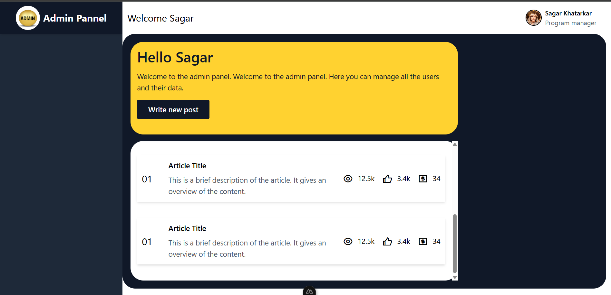
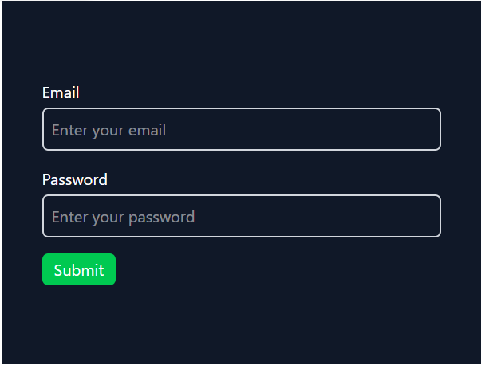

# 📝 Nuxt 3 Blog Post App

A simple full-stack blog application built with **Nuxt 3** that supports **CRUD operations** and **Server-Side Rendering (SSR)**. This project demonstrates how to build dynamic pages, use Nuxt’s API routes, and render content server-side for SEO and performance benefits.

---

## 🔍 Features

- ✅ View all blog posts
- ✅ View a single post by ID
- ✅ Create a new post
- ✅ Edit/update an existing post
- ✅ Delete a post
- ✅ Server-side rendering (SSR) for SEO and fast load
- ✅ Built-in API routes using Nuxt's `server/api` directory
- ✅ Simple in-memory mock database (no external backend)
- ✅ Modern structure using Vue 3 + `<script setup>`

---

## 🧰 Tech Stack

| Technology     | Purpose                                |
|----------------|----------------------------------------|
| Nuxt 3         | Vue-based full-stack framework         |
| Vue 3          | Frontend framework                     |
| Tailwind CSS   | Styling with utility-first CSS         |
| Nuxt API Routes| Backend logic (CRUD) inside frontend   |
| SSR            | Fast first loads and SEO optimization  |
| TypeScript     | (Optional) For type safety             |

---

## 📁 Folder Structure

